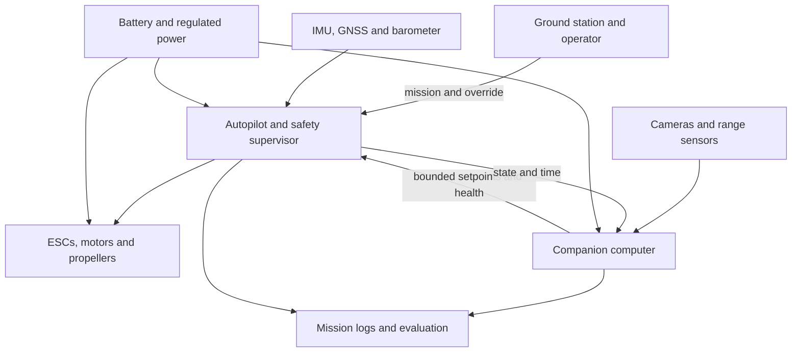

# DJI: origins, engineering, manufacturing and an AER development path

**Research date:** 3 October 2026  
**Scope:** Civilian camera, inspection and research multirotors; development from subsystem prototypes to a supportable product.  
**Status:** Research and engineering proposals, not measured AER results or a flight-qualified design.

## Read this study

1. This document: DJI's beginnings, strategy, architecture and business lessons.
2. [Subsystem development guide](subsystem-development.md): what every major part does, how to develop it, and acceptance evidence.
3. [Manufacturers and sourcing](manufacturers-and-sourcing.md): worldwide and Indian supplier directory, provenance and procurement workflow.
4. [AER implementation roadmap](aer-roadmap-and-budget.md): first platform, illustrative BOM, budgets and staged development.
5. [Sources and evidence limits](sources.md): primary-source links, what was established and what remains unknown.

## 1. The answer for AER

**Start with a reliable flight platform and one measurable civilian capability. Develop custom hardware after its requirement is demonstrated.**

AER currently identifies itself as an R&D repository in the foundation stage. Its system overview separates autonomy, flight-control interfaces, simulation, hardware abstraction and evaluation. This study preserves those boundaries. It proposes an open autopilot baseline for research; it does not change AER's architecture into a DJI-specific implementation.

The central lesson from DJI is integration. A motor that produces thrust is only one element. A useful drone must consistently start, estimate its state, fly, capture useful information, handle faults, land, save data and be serviceable. The customer experiences that whole sequence.

For AER, a promising first hypothesis is **repeatable visual inspection of a controlled test structure, with traceable image coverage and mission logs**. This is a proposal, not a selected market or established capability. It offers metrics that connect robotics work to an actual output.

Do not make an entire DJI competitor the first milestone. First reproduce a simulated mission, then build a validated research aircraft, then demonstrate the inspection output. Outsource commodity fabrication while retaining system specifications, interfaces, test data and differentiated software.

## 2. How DJI started

### Verified foundation

DJI says it began in a small office in 2006. Its account identifies Frank Wang, also known as Wang Tao, as the founder during his time at Hong Kong University of Science and Technology. DJI initially built components for remotely controlled aircraft before combining flight controllers, transmission and stabilization technologies into integrated drones. [S01–S03]

That sequence matters: the company had a technical entry point in controlling aircraft, then expanded the scope of the product. It did not need to manufacture every semiconductor or battery cell to develop a valuable flight system.

### Milestones and their significance

| Period | Supported milestone | Engineering/business interpretation for AER |
|---|---|---|
| 2006 | DJI founded; early work centered on RC aircraft components and flight-control technology | Solve one difficult subsystem well and learn through real hardware |
| Before the consumer Phantom | Separate aircraft technologies were progressively integrated | Own the interfaces and system behavior, even when buying parts |
| 7 January 2013 | DJI announced Phantom as an easy-to-fly consumer quadcopter with Naza-M/GPS autopilot, remote control and GoPro mount | Reduce assembly and tuning friction; original Phantom was not today's integrated camera product |
| Subsequent imaging development | DJI describes its progression toward compact three-axis aerial gimbals | Useful images require mechanics, control and optics to work together |
| March 2016 | Phantom 4 announcement emphasized intelligent camera flight and obstacle sensing | Add perception to a dependable flight platform |
| 27 September 2016 | Mavic Pro introduced a portable foldable design with stabilized imaging | Portability is a systems constraint affecting structure, cooling, power and calibration |
| 2016 onward | DJI Enterprise formation and partner ecosystem described by DJI | Industrial value includes applications, integration, training and support |

Sources: [S01–S07]. This is a milestone selection, not an exhaustive product chronology.

**Do not confuse a press-release announcement with a first shipment in every country.** The dated Phantom announcement is used here rather than asserting an exact worldwide first-sale date.

### Why this progression worked: analysis

1. **Control removed a fundamental barrier.** Aerial imagery becomes commercially useful only when flight is sufficiently predictable.
2. **Integration moved engineering work away from the buyer.** Buyers no longer needed to choose, solder and tune all subsystems themselves.
3. **A camera gave the flight an obvious purpose.** Customers could judge image quality and operational convenience.
4. **Product refinement addressed everyday friction.** Carrying, charging, configuring, transporting and repairing all influence adoption.
5. **Shared engineering could support multiple applications.** Stabilization, embedded control and imaging are reusable capabilities.
6. **An ecosystem broadened deployment.** Application developers could address specific workflows while DJI supplied a platform.

These are interpretations of the product progression, not a verified causal model of DJI's financial success.

### What this research does not establish

DJI is privately held. This study does not assert audited current revenue, a precise market share, profit per unit, startup funding amounts, the exact founding BOM, current factory capacity or a complete internal supplier list. Public product descriptions do not reveal all manufacturing arrangements.

There is no universal “DJI parts list”: different models and board revisions use different designs. Supplier candidates below are for **AER-compatible development**, not a claim that DJI uses them. A chip identified in one teardown would establish evidence only for that sampled board, not every DJI aircraft.

## 3. DJI's product is a complete system

### Functional decomposition

| Layer | Required behavior | Main disciplines | Key dependency |
|---|---|---|---|
| Structure | Hold components, preserve stiffness, survive loads | Mechanical design, composites, vibration, DFM | Mass and resonance affect propulsion and sensing |
| Propulsion | Produce controlled thrust efficiently | Motor design, aerodynamics, power electronics | Motor, propeller, ESC and battery must be matched |
| Power | Supply stable electrical energy and monitor health | Batteries, BMS, DC/DC design, connectors | Voltage sag can compromise thrust and compute |
| Flight controller | Estimate state and stabilize aircraft | Embedded systems, control, estimation, real-time scheduling | Timing and sensor quality affect control |
| Navigation | Know position, motion and available flight space | GNSS, inertial fusion, vision, range sensing | Environment and observability determine reliability |
| Mission/autonomy | Turn a task into bounded commands | Robotics, planning, supervisory logic | Must respect autopilot authority and health |
| Imaging/payload | Deliver useful calibrated data | Optics, imaging, gimbals, synchronization | Motion, vibration and exposure affect output |
| Communications | Deliver control, telemetry and payload data | RF, networking, codecs, security | Link loss must have a defined aircraft response |
| Ground software | Plan, monitor, configure and review | UX, maps, application engineering | Operator must understand state and failures |
| Production/support | Reproduce and maintain reliable units | Manufacturing, quality, logistics, repair | Traceability and calibration must survive scaling |

A minimum research drone can omit a gimbal, RTK, lidar and a companion computer. An inspection product may need some of them. “Required” means required to satisfy the mission, not every component in every build.

### Proposed AER architecture

This diagram is an AER proposal, not a reverse-engineered DJI architecture.

PX4 documentation describes a flight controller executing core flight/safety code and an optional companion computer supporting higher-level software. [S08] The architecture should ensure a stalled perception process cannot directly remove basic stabilization. Define offboard-command timeout, mode transitions and operator override behavior explicitly.

A gimbal is not a substitute for navigation sensing. A moving gimbal changes camera-to-body orientation; if its imagery enters state estimation, its orientation and timestamps need to be modeled.

## 4. Technologies AER must understand

### Flight dynamics and control

Understand forces, moments, inertia, actuator saturation and motor response. The flight stack commonly uses cascaded position, velocity, attitude and body-rate control. Gains that work on one airframe may fail on another because mass, stiffness, propeller size and vibration differ.

Learn PID control first; use more advanced control when an experiment establishes the need. Record tracking error, settling time, saturation and disturbance response. A good-looking simulator flight is insufficient if actuator lag, sensor noise or mass are unrealistic.

### State estimation

An IMU measures motion, not an absolute global position. Gyro bias and accelerometer errors accumulate. GNSS supplies global information outdoors but can suffer multipath or poor coverage. Barometric measurements support altitude estimation but are influenced by airflow and environment. Magnetometers are vulnerable to nearby currents and magnetic materials.

Estimation requires coordinate frames, timestamps, sensor calibration, covariance, consistency checks and fault detection. RTK can improve GNSS positioning under suitable conditions; it is not an indoor navigation solution or a guarantee of accurate imagery.

### Embedded electronics and real-time software

Develop competence in C/C++, MCU peripherals, SPI/UART/I2C/CAN, watchdogs, interrupts, DMA, memory and timing. Separate noisy power electronics from sensitive sensing. A PCB with correct connectivity can still fail through poor grounding, vibration or unstable supplies.

For research, begin with a supported board and a maintained autopilot release. Custom avionics come after sensor, interface or packaging constraints justify them.

### Perception and autonomy

Camera calibration, image exposure, motion blur, extrinsics, synchronization and compute latency matter before model accuracy. A model's offline accuracy is not proof of navigation safety.

Start with logged-data analysis and simulated perception failures. Introduce bounded vision-based behaviors after measuring false detections, missed obstacles, frame drops and worst-case latency. Treat missing or stale observations as a defined state, not permission to continue guessing.

### Communications and ground station

Control, telemetry and high-rate video have different bandwidth/latency needs. A research aircraft can use a separate manual RC link and telemetry link. That is simpler than creating a proprietary digital video ecosystem immediately.

Open protocols can support development, but protocol openness does not guarantee authentication. Assess command acceptance, firmware integrity, keys, operator access and data privacy at product stage.

### Product manufacturing and quality

Design for assembly, testing and repair. Establish connector keying, torque instructions, wiring restraint, serialized hardware revisions, calibration fixtures and test records. A single successful prototype proves feasibility for that unit; it does not establish yield, reliability or repeatability.

## 5. What to own, what to buy

| Capability | First AER prototype | Later ownership opportunity | Why |
|---|---|---|---|
| Flight stack | Use PX4 or ArduPilot with pinned versions | Specific estimator/controller/interface changes | Mature behavior gives a measurable baseline |
| Flight-controller board | Buy supported genuine board | Design carrier, then custom FC if necessary | Bring-up and qualification require considerable effort |
| Motors/ESCs/props | Buy a matched propulsion family | Custom propulsion only for demonstrated requirements | Airborne reliability depends on thermal and dynamic validation |
| Frame/mounts | Buy basic frame; design mounts | Own mission-specific structure | Local fabrication is comparatively accessible |
| Battery | Buy qualified pack | Define custom pack with specialist manufacturer | Pack mechanics and protection need flight-specific evaluation |
| Camera | Buy documented module | Own calibration, synchronization and imaging pipeline | These often influence mission results more than resolution alone |
| Gimbal | Buy documented unit if required | Custom unit for specific mass/precision needs | Mechanics/control integration is substantial |
| RF | Use compliant documented modules | Custom radio only with a strong business case | RF development adds certification and interoperability costs |
| Mission software | Build | Build | Differentiation and fast iteration |
| Dataset/evaluation | Build | Build | Evidence improves product decisions |
| Semiconductor/cell manufacture | Source | Usually continue sourcing | Foundries, MEMS fabs and cell plants are distinct capital-intensive industries |

“Developing each part” can mean designing a subsystem with purchased ICs, producing a component such as a motor, or fabricating its underlying materials and silicon. These are different levels of industrial capability. Building a drone does not require owning a semiconductor fabrication plant.

## 6. Business model and moat: lessons, not financial claims

AER should distinguish:
- **Aircraft sale:** a hardware product with warranty, repair and inventory obligations.
- **Inspection service:** revenue tied to a completed job, operator time and quality of deliverables.
- **Software/data product:** reports, analytics or workflow integration on third-party aircraft.
- **Subsystem supplier:** avionics, propulsion, camera integration or specialized hardware for other OEMs.
- **Research platform:** reproducible tooling, development kits and support.

The defensible asset may be inspection data quality, a reliable calibration process or integration with customer maintenance systems. A generic assembly of catalog components is easier to reproduce.

Before investing in custom hardware, interview target users: What asset is inspected? What defects matter? What output triggers an action? How often is it needed? What is the existing cost? Who can legally operate? What failure invalidates the job?

Track job economics:
**Contribution per job = customer payment − travel − operator time − consumables − compute/storage − expected repair/warranty allocation.**

For hardware:
**Gross margin = selling price − landed BOM − assembly/calibration/test − packaging − expected warranty costs.**

Neither formula includes all company overhead, R&D, sales or financing. Cost each separately. DJI's consumer scale and supply-chain economics are not a valid cost model for a small AER batch.

## 7. Principal failure modes

| Failure | Likely system impact | Development response |
|---|---|---|
| Motor/prop mismatch | Poor efficiency, overheating, inadequate control margin | Obtain exact voltage/prop thrust curves; validate on test stand |
| Excess vibration | Corrupted IMU/imagery, unstable estimation | Balance propulsion; assess mounts and resonance; inspect logs |
| Rail brownout | Controller/companion reset | Instrument transients and qualify power paths |
| GNSS degradation | Position drift or mode change | Simulate and test configured estimator/failsafe behavior |
| Companion crash | Missing mission commands | Autopilot timeout and verified operator recovery |
| Video/telemetry failure | Reduced operator information | Separate operational responses for each link |
| Magnetic interference | Heading inconsistency | Placement, calibration and load-dependent testing |
| Battery imbalance/sag | Reduced endurance and thrust | Pack screening, current measurement and reserve model |
| Wrong frame/time convention | Incorrect commands or fused state | Interface tests for NED/ENU, body frames and timestamps |
| Uncontrolled revisions | Non-reproducible failures | Record hardware, firmware, parameters and calibration |
| Proprietary SDK mismatch | Application cannot use planned aircraft features | Verify exact model/firmware/SDK compatibility before purchase |
| Untraceable sourcing | Counterfeit or silent component substitutions | Procurement records and incoming inspection |

## 8. Recommended reading sequence

1. Read this case study and define one mission hypothesis.
2. Read the subsystem guide's structure, propulsion, power and flight-controller sections.
3. Follow the official autopilot simulation documentation and reproduce a baseline.
4. Create an interface specification and compatibility matrix.
5. Request quotations using the sourcing guide.
6. Run bench validation before propulsion flight testing.
7. Add perception and payload functions progressively.
8. Revisit manufacturing and commercial requirements once prototype evidence exists.

**Immediate AER deliverable:** one reproducible simulation scenario and its evaluation report. Hardware procurement should follow a mass/power/interface budget, not precede it.
