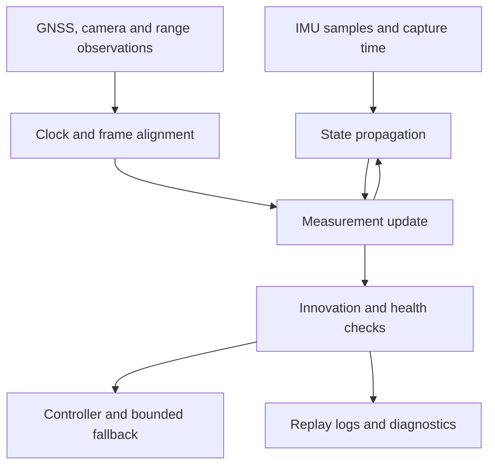

# State estimation, sensor fusion and timing: first principles

**Scope:** civilian measurement, replay and simulation. Theory and worked examples are **I/E**, not measured aircraft results. PX4's documented implementation is a reference, not code validated by AER.

## Function and physical model

A controller needs an estimate of orientation, velocity and position. An **inertial measurement unit (IMU)** typically combines gyroscopes measuring angular velocity with accelerometers measuring specific force. A stationary accelerometer generally has magnitude close to local gravitational acceleration; it is not reporting zero simply because velocity is zero [R005](../sources.md#r005).

Use a right-handed local world frame W and body frame B. Define `R_WB` to rotate a vector expressed in B into W. With gyro bias `b_g`, accelerometer bias `b_a`, noise `n`, and gravity vector `g_W`:

$$\omega_m=\omega_B+b_g+n_g,$$
$$f_m=R_{WB}^{T}(\ddot p_W-g_W)+b_a+n_a.$$

Then an elementary propagation step is

$$a_W=R_{WB}(f_m-b_a)+g_W,$$
$$v_{k+1}=v_k+a_W\Delta t,\qquad p_{k+1}=p_k+v_k\Delta t+\tfrac12a_W\Delta t^2.$$

Orientation evolves using measured angular velocity with bias removed. A flight-quality implementation also handles rotation integration, covariance, discretization and numerical stability. These equations explain the dependency; they are not replacement flight firmware.

## Why inertial data alone drifts

**E:** a constant unmodeled acceleration error of `0.01 m/s²` produces `0.5 × 0.01 × 60² = 18 m` position error after 60 s in a simplified one-axis model. A 1° orientation error leaks approximately `9.81 sin(1°) = 0.171 m/s²` of gravity into horizontal acceleration. Real error is coupled and time-varying, but the example explains why a small attitude error can dominate.

GNSS (global navigation satellite systems) observes global motion outdoors. Barometers infer height changes from pressure. Magnetometers observe the local magnetic field. Optical flow estimates image motion; without range/scale assumptions it is not an absolute metric position sensor. Cameras and lidar constrain motion relative to scene structure. Each observation is useful only when its error model and environment are appropriate.

## Fusion and observability

An extended Kalman filter (EKF) propagates a state and its uncertainty, then corrects them using measurements. For a locally linearized measurement model:

$$r=z-h(\hat x),\quad S=HPH^T+R,\quad K=PH^TS^{-1},$$
$$\hat x^+=\hat x^-+Kr.$$

Here `r` is the innovation (prediction-measurement mismatch), `P` the estimated state covariance, `R` measurement-noise covariance and `H` the measurement Jacobian. Rotation errors require suitable manifold/error-state treatment; the additive expression is explanatory.

**Observability** asks whether available measurements and motion can distinguish unknown states. A sensor cannot reveal an unobservable quantity merely because the filter reports a small covariance. A static monocular camera cannot independently recover arbitrary metric scene scale. Poorly excited calibration motion can leave camera-to-IMU parameters weakly constrained.

PX4 v1.16 documentation describes buffered sensor data, a delayed fusion horizon, delay parameters and forward propagation to the current time [R003](../sources.md#r003). Do not copy parameter values across firmware versions. Kalibr explicitly estimates spatial and temporal camera–IMU parameters [R013](../sources.md#r013); successful optimization still needs validation on separate recordings.

Original conceptual diagram, not a reverse-engineered aircraft schematic.

## Interfaces that must be explicit

| Field | Contract | Failure if omitted |
|---|---|---|
| Capture timestamp | Monotonic clock; ns integer; source named | Callback latency becomes apparent physical motion |
| Arrival timestamp | Separate host clock and conversion | Transport delay is invisible |
| Coordinate frame | Axis directions, handedness, reference origin | Sign errors masquerade as unstable tuning |
| Extrinsics | Sensor-to-body rotation/translation and uncertainty | Lever-arm accelerations and camera motion mismatch |
| Units | rad/s, m/s², m; pressure Pa; temperature °C | Silent scale errors |
| Calibration | Bias/scale model, temperature, serial/revision/date | Old calibration applied to new hardware |
| Quality | Saturation, dropouts, sensor state, uncertainty | Invalid data accepted as precise evidence |

A camera on a gimbal has a time-varying transform to the body. A fixed camera extrinsic cannot be reused unchanged. An IMU displaced from the center of rotation sees rotational acceleration components; its translation is not merely a drawing detail.

## Worked timing example

**E:** at 2 m/s, a 20 ms camera–IMU offset corresponds to 0.04 m of translation. At 90°/s, the same offset corresponds to 1.8° rotation. Those are kinematic consequences, not an estimator accuracy prediction. Motion direction, scene geometry and shutter readout change pixel residuals.

Android sensor events use a monotonic elapsed-realtime time base [R005](../sources.md#r005). Camera2 declares whether capture timestamps have a comparable REALTIME source or an UNKNOWN source [R004](../sources.md#r004). Recording nanoseconds in both files does not prove synchronization. See [phone MVP](../phone-mvp.md).

## Failure modes and discriminating tests

| Failure | Observable symptom | Civilian bench/replay test | Do not conclude |
|---|---|---|---|
| Gyro bias/temperature drift | Orientation drift changes with warm-up | Stationary recordings before/after warming in normal use | One bias estimate applies at all temperatures |
| Vibration/aliasing | Spectral peaks, clipping, biased acceleration | Compare stationary powered electronics and controlled vibration logs | A software filter fixes mechanical saturation |
| Magnetic interference | Heading changes with current or position | Compare logged magnetometer data across equipment states | Magnetometer disagreement means GNSS is wrong |
| GNSS multipath/dropout | Position jumps or inconsistent residuals | Inject saved/synthetic gaps in simulation | Return-to-home is always appropriate without position |
| Camera rolling shutter | Motion-dependent geometric residuals | Repeat target motion at several speeds | A single frame timestamp represents every row equally |
| Timestamp offset/drift | Residual correlated with angular motion | Replay offsets; fit clock mapping on training sequence, test held-out sequence | Best fitted offset is universal across phones |
| Overconfident covariance | Small reported uncertainty but large reference error | Compare residual statistics with independent reference | Smooth output is accurate output |

## Development and build-versus-buy

Buy a documented IMU or flight controller first. Skills: linear algebra, probability, rigid-body mechanics, embedded acquisition and signal analysis. Tools: timestamped logger, plotting/FFT, calibration target, repeatable mount, temperature log and independent reference when claiming accuracy. A logic analyzer becomes useful when measuring hardware trigger or bus timing.

Design a custom sensor PCB only after documenting required noise, range, sample rate, bus timing, thermal behavior and power isolation. Fabricating the MEMS element itself requires specialized microfabrication; it is a separate industrial undertaking. A custom board using a bought sensor does not constitute domestic manufacture of that sensor.

## Proposed AER exit gate

Produce three repeatable static recordings and several manual target-motion sequences. Demonstrate that all timestamps are monotonic within a session, frame and IMU drops are counted, coordinate-frame transforms are documented, and a deliberate 20 ms injected offset is detected by the evaluation. Quantitative residual thresholds must be chosen after measuring the baseline and reference uncertainty. No airborne estimator authority is granted by passing this gate.

Open questions: target phone timestamp source; rolling-shutter metadata availability; thermal drift over longer sessions; independent reference accuracy; selected autopilot release. Visual reference: [PX4 EKF documentation](https://docs.px4.io/v1.16/en/advanced_config/tuning_the_ecl_ekf), whose illustrations are linked rather than copied.
