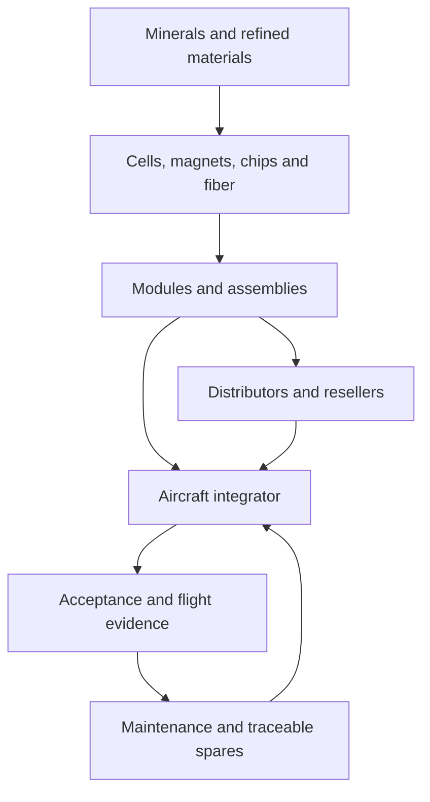

# Global and Indian supply-chain map

**Cutoff: 2026-10-05.** [Supplier dataset](../data/suppliers.csv) records verified product/service evidence and separates roles. No supplier was audited, contacted or qualified. Website access is not confirmation of available stock. AER candidates are not asserted to be DJI's suppliers.

## Trace upstream, not just the seller

Original process map. Country of seller, company headquarters, design origin, fabrication, packaging and final assembly are separate attributes.

| Subsystem | Upstream dependencies / processes | Evidence-backed candidates | Substitution/test constraint |
|---|---|---|---|
| Batteries | Active materials, separator/electrolyte, cell production, pack interconnects, monitoring and enclosure | Molicel cells [R048](../sources.md#r048); Voltherm pack vendor [R052](../sources.md#r052) | Chemistry, impedance, current/temperature, charger and transport evidence; similar Ah is insufficient |
| Motors / ESCs | Copper windings, electrical steel, magnets, bearings, MOSFETs, gate drivers, MCU and PCB assembly | Vector Technics propulsion [R049](../sources.md#r049); ST design reference [R058](../sources.md#r058) | Motor/propeller/voltage curve, thermal limits, command behavior and balancing |
| Propellers / structures | Polymer/composite feedstock, fiber/resin, layup/molding, machining and joining | APC technical resources [R061](../sources.md#r061); Toray fiber [R062](../sources.md#r062) | Layup/geometry/RPM limits, fatigue, tolerances and matched rotor tests |
| Autopilot | MCU and MEMS fabrication, packaging, PCB manufacture, assembly, firmware and calibration | Holybro board [R045](../sources.md#r045); Bosch IMU [R047](../sources.md#r047) | Same board name can hide revision changes; driver/calibration and failure analysis |
| GNSS | RF semiconductor, oscillator, filters, antenna, carrier and corrections | u-blox [R046](../sources.md#r046) | Exact suffix, antenna supply, correction format, timing and environment |
| Camera / optics | Sensor fabrication, lens manufacture/coatings, PCB/flex, alignment, ISP and calibration | Sony sensors [R059](../sources.md#r059); e-con modules [R050](../sources.md#r050) | Pin compatibility does not ensure same readout, metadata, shutter or color pipeline |
| Companion computer | Processor, memory, storage, carrier, regulators and cooling | NVIDIA module family [R060](../sources.md#r060) | SDK/lifecycle, power modes, connectors, thermal and application benchmarks |
| Local electronics production | Bare PCB process, stencils, component procurement, reflow, inspection and functional test | LionCircuits [R051](../sources.md#r051) | Imported chips can remain critical; define acceptable substitutions and test coverage |
| Procurement channel | Inventory aggregation, authenticity, warranty, shipping and import documents | Robu [R053](../sources.md#r053) | Retail listing is not manufacturing evidence; obtain lot/origin documentation |
| Integrated aircraft | Assembly, calibration, software, certification and support | ideaForge [R064](../sources.md#r064); Dhaksha [R065](../sources.md#r065) | India-based branding/product evidence does not establish domestic content of every component |

## Concentration: what is supported and what is inferred

The IEA's 2026 outlook reports persistent concentration in refining and vulnerability in materials including magnet rare earths and graphite [R063](../sources.md#r063). That is macro-level evidence; it does not establish the material origin of a particular drone motor or pack.

**I:** changing from one reseller to another may leave the same upstream dependency. True alternatives require different qualified parts, compatible firmware/interfaces and replacement test evidence. Dependence also includes compilers, firmware maintainers, image-processing SDKs, maps and hosted fleet services. A physically interchangeable component can still require a software port or new calibration.

## Realistic India development levels

The retrieved vendor pages establish Indian routes for propulsion development, camera modules, pack products, PCB assembly and integrated aircraft. They do **not** demonstrate a completely domestic bill of materials. A practical progression is local mission software and testing; local mounts/structures and electronics assembly; selected custom boards and propulsion work; deeper upstream partnerships when volume and requirements justify them.

For each item ask who designed it, who manufactured the critical component, where assembly occurred, who owns test records and whether the next batch is identical. Require evidence at SKU/lot level before making a “domestic manufacturing” claim. Do not assume that a supplier's address is its factory location.

## Price and procurement example

Holybro's accessed page displayed **USD 422.99** for Pixhawk 6X Standard v2A with PM02D, SKU `11073+18117+15011`, with a minimum quantity of one in page data [R045](../sources.md#r045). This is a dated web observation, not an Indian landed quote or guaranteed shipment. Other configurations have different prices. Current lead time and shipment eligibility remain unknown; the page carried an office-closure notice.

For remaining suppliers, price, MOQ and lead time are `unknown` rather than guessed. Request a written quote with currency, taxes, Incoterms, validity, exact revision, quantity, lead time, warranty, test reports and substitution policy. No RFQs were sent by this research.

## Qualification plan

Use documentation review, sample inspection, electrical/mechanical tests, integration trials and lot acceptance as separate gates. Record certificate issuer, number, facility, product scope and validity; a website logo is insufficient. Ask for traceable cells/chips, supplier change notices and end-of-life policy. Keep two **qualified** sources where economically justified, not merely two links.

Open questions: domestic content per SKU, qualified magnet and cell alternatives, Indian camera/compute availability, actual lead times, certification scope and repair support. The [existing sourcing study](../../case-studies/dji/manufacturers-and-sourcing.md) contains additional leads that are not silently promoted to newly verified suppliers here.
